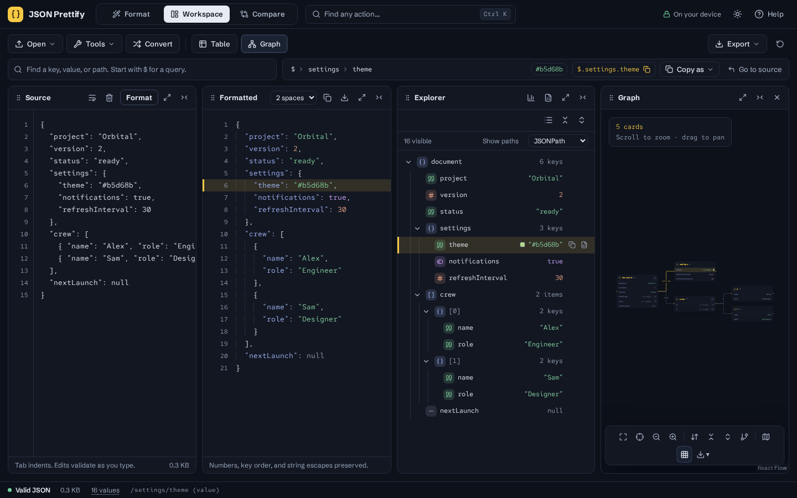
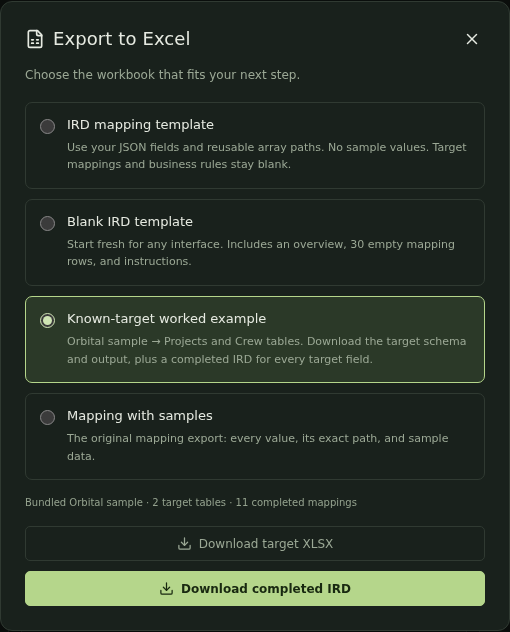

# JSON Prettify

A private JSON workspace at **[jsonp.bjk.ai](https://jsonp.bjk.ai)**. Format a document, inspect its values, and navigate its structure without sending your JSON to a server.



## Workspace

- **Source:** live validation, file import or drop, line wrapping, format in place, clear, and undo the last replacement.
- **Formatted:** syntax colors and line numbers, 2- or 4-space indentation, compact output, copy, and JSON download. Formatting preserves exact number tokens, negative zero, exponents, string escapes, key order, and duplicate keys.
- **Explorer:** search keys, values, or types; switch between tree and list; expand or collapse branches; select a value to highlight its source and formatted lines. Full paths appear beneath each field. Choose JSONPath, JSON Pointer, or JavaScript display; the visible copy buttons use that format. Click breadcrumbs to select a parent, use previous/next or arrow keys to move through results, copy exact values, and jump directly to the source. Long selected references wrap instead of truncating. Root JSON Pointer is the empty string; `/` identifies an empty property name.
- **Graph:** connected container cards with scalar values and color swatches, zoom, pan, fit, manual card positioning, and selection linked to the source. Focus the graph to give it the full workspace.
- **Export XLSX:** choose a clean IRD from your JSON structure, a blank IRD for any interface, the original mapping export with samples, or a known-target worked example. Clean templates have no sample values; the original export retains exact sample numbers as text.

Drag pane headers to reorder, drag dividers to resize, and collapse or focus individual panes. Focused dividers also accept arrow keys. Reset layout restores the default arrangement. On phones, switch panes using tabs. Dark and light themes and pane order persist on this device; document contents do not persist and are lost on reload. There are no AI requests, external fonts, or analytics.

### Shortcuts

Use Ctrl on Windows/Linux or ⌘ on macOS.

| Keys               | Action                        |
| ------------------ | ----------------------------- |
| Ctrl/⌘ + Enter     | Format source                 |
| Ctrl/⌘ + Shift + C | Copy formatted JSON           |
| Ctrl/⌘ + S         | Download JSON                 |
| Ctrl/⌘ + /         | Show/hide shortcut help       |
| Escape             | Close help or exit pane focus |

When the explorer is focused, ↑/↓ and Home/End navigate visible results; Ctrl/⌘ + C copies the selected path in the chosen format. Double-click an explorer value to copy that path. Selecting a value preserves explorer focus; **Go to source** opens and focuses the editor, including on mobile.

### IRD workbooks

Open **Export XLSX** from the workspace toolbar or the explorer’s Excel button.



- **IRD mapping template** is the default for valid JSON. It uses source fields, paths, and observed data types, with repeated array records combined into reusable `[*]` paths. Nonempty objects are represented by their child fields; arrays and empty containers remain available as mappings. Primitive roots use `$`. No sample values are sent to the template export worker or included in the workbook.
- **Blank IRD template** works even without valid JSON. It contains 30 empty, editable mapping rows.
- **Known-target worked example** provides two independent downloads: a target XLSX with Projects and Crew tables, field definitions, expected output, and the bundled Orbital source JSON; and a completed IRD mapping all eleven target columns. Select this option, download the target workbook, then download the completed IRD. Both work without valid editor JSON and always use the bundled sample. The mapping covers direct fields, uppercase codes, boolean Y/N conversion, crew counts, parent foreign keys, repeated crew rows, optional launch dates, and validation/rejection rules. Use **Sample** in the workspace to explore that source. This is an explicitly defined example contract, not a schema inferred from your data.
- **Mapping with samples** retains the original `Data_Mapping_IRD` sheet and its existing columns and per-value paths.

Both clean templates contain **Overview**, **Field Mapping**, and **Instructions** sheets. Mapping columns cover source field/path/type, target field/path/type, requiredness, cardinality, transformations/business rules, defaults, validation constraints, and descriptions. Those business decisions stay blank. Types are observed from the provided document, not a guaranteed schema; confirm them against your source contract. This is a general-purpose IRD layout you can adapt to your organization. The mapping sheet has column widths and filters and is fully editable.

### Document limits

Formatting runs in a cancellable Web Worker after a short debounce. Source is limited to 5 MiB of UTF-16 code units; imported files are limited to 5 MiB in bytes. The workspace supports 50,000 values, 256 nesting levels, and 20 MiB of formatted output. Exceeding a limit produces an explicit error; the source stays intact. Blank input has no output.

The graph supports 400 containers. Larger documents remain available in the searchable explorer and full exports. Primitive roots have no container graph. Duplicate keys are preserved and flagged; reference selection uses the last occurrence, and the graph requires unique paths. Validation follows `JSON.parse` syntax; it does not check a schema.

## Development

Node.js **22.12+** and npm are required.

```sh
npm ci
npm run dev
```

Open `http://127.0.0.1:3000`. No environment variables or API keys are needed.

```sh
npm run check
npx playwright install chromium
npm run test:e2e
npm audit
```

GitHub Actions runs these checks on pushes and pull requests, testing the production build in Chromium.

`check` verifies formatting, strict TypeScript, core regressions, and a production build. Browser tests cover desktop/mobile flows, exact numbers and escaped paths, root copy, file import, Excel/JSON downloads, graph navigation and focus, themes, large-document virtualization, and accessibility. To test an existing deployment, set `TEST_URL` instead of starting Vite:

```sh
TEST_URL=https://jsonp.bjk.ai npm run test:e2e
```

## Code map

| File                                    | Responsibility                                                          |
| --------------------------------------- | ----------------------------------------------------------------------- |
| `src/App.tsx`                           | Workspace state, worker lifecycle, source selection, and layout         |
| `src/json.ts`, `src/json.worker.ts`     | Lossless formatting, typed ranges, and background processing            |
| `src/Explorer.tsx`                      | Searchable virtualized tree/list, inline paths, and keyboard navigation |
| `src/PathBar.tsx`                       | Parent breadcrumbs, current-path copy, and source reveal                |
| `src/Output.tsx`                        | Virtualized syntax-colored output and line highlighting                 |
| `src/Graph.tsx`                         | Lazy-loaded graph and height-aware layout                               |
| `src/ExportDialog.tsx`                  | Workbook choices and export feedback                                    |
| `src/ird.ts`                            | Sample-free template fields, reusable paths, overview, and instructions |
| `src/export.ts`, `src/export.worker.ts` | Downloads and background XLSX generation                                |
| `src/index.css`                         | Themes, responsive layouts, and reduced-motion styling                  |

SheetJS 0.20.3 is vendored from its [official distribution](https://docs.sheetjs.com/docs/getting-started/installation/nodejs/) because the npm registry package is outdated. Its upstream license is included in the tarball. Graph and Excel code load only when used.

See [deployment instructions](docs/DEPLOYMENT.md) and [release notes](docs/CHANGELOG.md).
