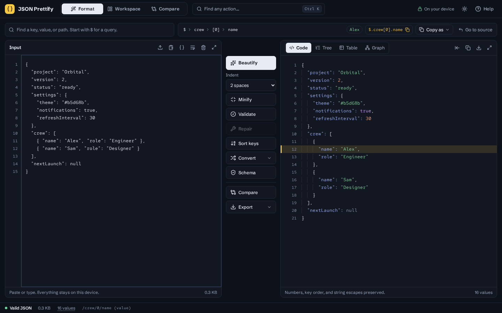
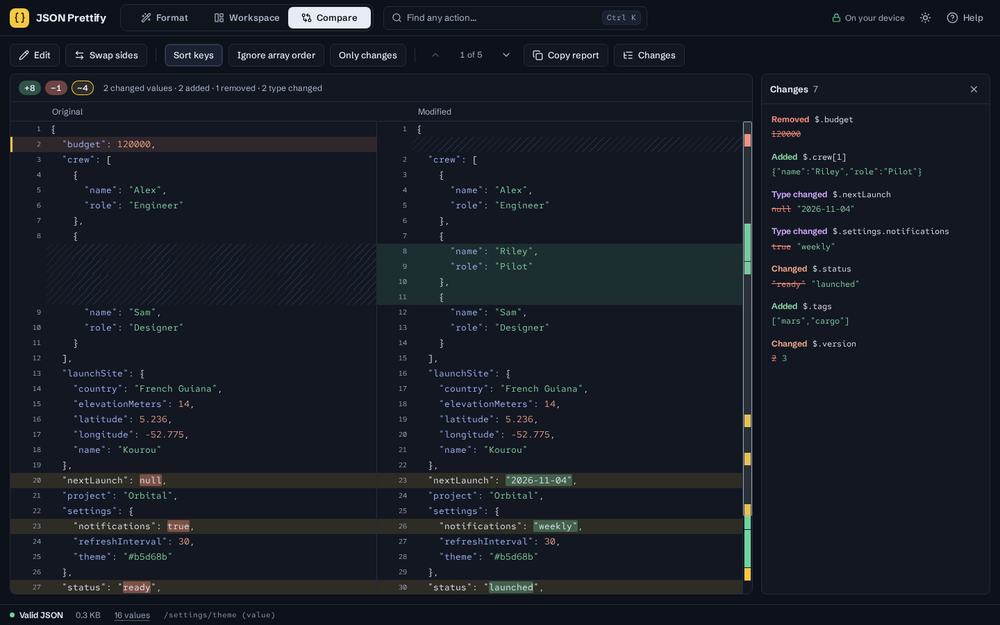
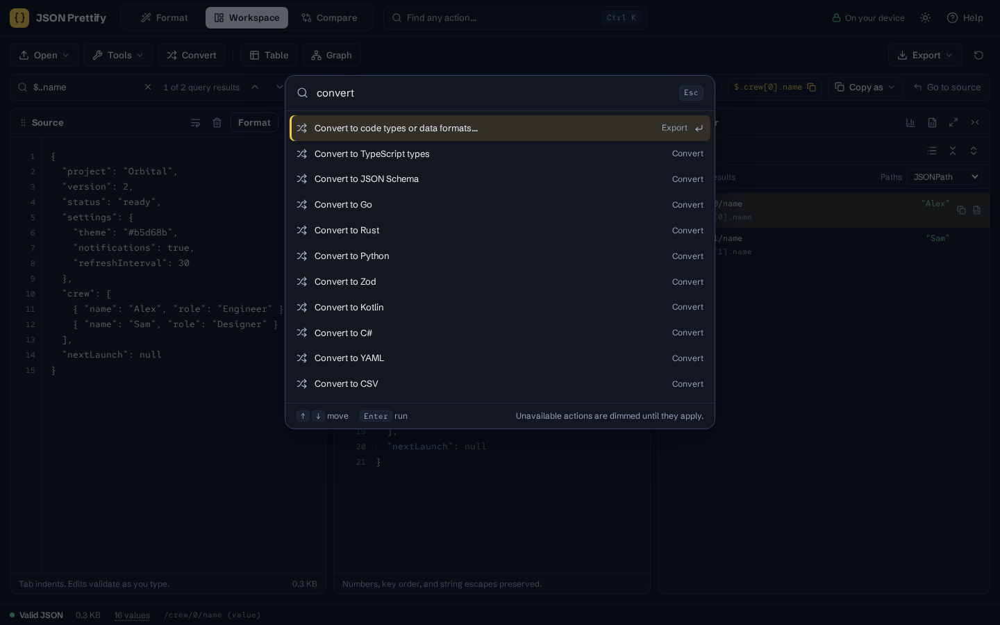

# JSON Prettify

A private JSON toolkit at **[jsonp.bjk.ai](https://jsonp.bjk.ai)**. Format, repair, explore, graph, convert, validate, and compare JSON without sending it to a server.



## Three modes

Switch modes from the header. The address bar remembers your choice (`#format`, `#workspace`, `#compare`), so each mode can be bookmarked.

- **Format** is the quick one, in the spirit of jsonformatter.org. Paste on the left and read clean JSON on the right, with one column of clearly labelled actions between them: **Beautify** (2, 3, or 4 spaces, or tabs), **Minify**, **Validate**, **Repair**, **Sort keys**, **Convert**, **Schema**, **Compare**, and **Export**. The output can be shown as **Code**, **Tree**, **Table**, or **Graph**, and **Use the output as input** copies the result back. Drag the edge of the action column (or focus it and use ←/→) to change how much room input and output get; double-click it to reset.
- **Workspace** puts Source, Formatted, Explorer, Table, and Graph panes side by side for deep exploration. Panes can be dragged, resized, focused, and collapsed. Find and the selected value's path bar sit above them, in Format as well as Workspace.

  

- **Compare** lines up two documents side by side and highlights every difference down to the character. Scrolling is synced, **Prev/Next** steps through each change with an "i of N" counter, and **Only changes** folds unchanged lines. Keys can be sorted so key order never counts, and array order can be ignored. A list of value-level changes jumps to each one. Each side can open, paste, format, or repair its own document.



## Getting started

1. **Bring in data.** Paste, drop a file anywhere, or use **Open**. JSON, NDJSON, YAML, XML, CSV, TSV, Excel (XLSX/XLS), and OpenDocument (ODS) files all become JSON. Pasted YAML, XML, or CSV is detected and offered a one-click conversion.
2. **Fix it.** Broken JSON shows the exact line and column with a plain-language explanation. **Repair** fixes comments, trailing or missing commas, single and smart quotes, unquoted keys, Python `True`/`False`/`None`, `NaN`/`Infinity`, JSONP or `const x =` wrappers, Markdown code fences, unclosed brackets, and NDJSON (wrapped into an array). It lists every fix before you apply it.
3. **Read it your way.** Click any value, in any view, to see its exact path above the output, with buttons to copy the path (JSONPath, JSON Pointer, or JavaScript), the value, or both. Type in **Find** to match keys, values, types, and paths, or start with `$` to run a JSONPath query such as `$.crew[*].name`, `$..name`, or `$.crew[?(@.role == 'Designer')]`. **Enter** and **Shift+Enter** step through the matches; each one is selected, so the path shown is the exact path of that hit, even when a field of the same name exists under several branches. Matches also light up in the graph.
4. **Take it further.** Convert to types or data formats, validate against a JSON Schema, compare, export an Excel IRD workbook, or copy a share link.



Press **Ctrl/⌘ + K** to search every action by name. **Help** explains each mode and view and has clickable query examples. A short getting-started banner appears on the first visit.

## Views

- **Source:** line numbers, an error-line marker, Tab/Shift+Tab indentation, line wrapping, live validation, file import or drop, and multi-step undo and redo for every replacement (format, repair, transforms, open, clear). The message after each replacement has an **Undo** button, and the status line's **Invalid JSON** jumps to the error.
- **Code (Formatted):** syntax colors, line numbers, and indent guides, with indentation of 2, 3, or 4 spaces, tabs, or minified output. Formatting preserves exact number tokens, negative zero, exponents, string escapes, key order, and duplicate keys.
- **Tree (Explorer):** an accessible, virtualized tree with one-line rows: a type badge, the key, the value, and a preview of what is inside collapsed branches. Arrow keys move (→ expands or steps in, ← collapses or steps to the parent, Enter or Space toggles, `*` expands a branch, and typing jumps to a key). **Show paths** adds each value's path underneath, and search results always show it. Hover a row to copy its path or value. Search is shared with every view; the results replace the tree with a flat list, and the match you are on stays selected. Copy query results as a JSON array, and choose JSONPath, JSON Pointer, or JavaScript paths. Queries support names, wildcards, recursive descent, indexes, slices, unions, and filters with comparisons, regular expressions, `&&`, `||`, and `!`.
- **Table:** arrays of records as a sortable, filterable, virtualized grid. Click any cell to select that value, or convert the array to CSV.
- **Graph** (inspired by JSON Crack): connected cards for objects and arrays, with key labels on the edges.
  - Collapse or expand any branch, or all of them, or show only the selected branch.
  - Large documents start collapsed to 300 cards instead of refusing to draw.
  - Explorer search and query matches are highlighted, and selections elsewhere center the graph.
  - Toggle left-to-right or top-to-bottom layout, a minimap, and the grid.
  - Download a PNG or SVG of the whole graph, or copy a PNG.
  - Colour swatches show hex, `rgb()`, and `hsl()` values; URLs are links. Shift+1 focuses the root and Shift+2 fits the graph.
- **Insights:** value counts by type, nesting depth, most common keys, largest arrays, and the longest string. Open it from the status bar.

Dark and light themes (the system preference on a first visit, then your choice), the mode, indentation, the Format split, pane order, Show paths, and graph preferences persist on this device. There are no AI requests, external fonts, analytics, or network calls with your data.

### Tools

| Menu or action | What it does                                                                                                                                                                       |
| -------------- | ---------------------------------------------------------------------------------------------------------------------------------------------------------------------------------- |
| Open           | Open a JSON, YAML, XML, CSV/TSV, XLSX/XLS, or ODS file, paste from the clipboard, load the sample, or clear                                                                        |
| Tools          | Format, repair, minify, sort keys A–Z (recursive), remove nulls or empty values, keep only the selected value, escape/unescape a JSON string, YAML/XML/CSV text to JSON, undo/redo |
| Convert        | **Types:** TypeScript, JSON Schema 2020-12, Go, Rust (serde), Python dataclasses, Zod, Kotlin (kotlinx.serialization), C# (System.Text.Json). **Data:** YAML, CSV, XML             |
| Schema         | Validate against a JSON Schema (drafts 4, 7, 2019-09, 2020-12). Generate a starting schema from the document; click a problem to jump to it                                        |
| Compare        | The Compare mode described above                                                                                                                                                   |
| Export         | Copy formatted or minified JSON, download it, build an Excel IRD workbook, or copy a share link                                                                                    |

Type generators infer shapes across array items: keys missing in some items become optional, mixed types become unions, and `null` becomes nullable. All transforms and conversions keep exact number tokens. Imports keep numbers exact too: YAML and CSV values such as `9007199254740993` stay exact, CSV values such as `007` stay strings, and XML values stay strings. CSV export prefixes cells that start with `=`, `+`, `-`, `@`, a tab, or a carriage return with an apostrophe, unless the cell is a number, to prevent spreadsheet formula injection.

**Share links** compress the document into the URL fragment (`#json=…`). Browsers never send the fragment to the server, so the data lives only in the link. Links over 60,000 characters are refused; download the file instead.

**Keep my draft on this device** (in the command palette) is off by default. When it is on, the source is saved to this browser's local storage, up to 2 MiB, and restored on the next visit. Turning it off deletes the saved draft.

### Shortcuts

Use Ctrl on Windows/Linux or ⌘ on macOS.

| Keys                  | Action                                                |
| --------------------- | ----------------------------------------------------- |
| Ctrl/⌘ + K            | Find any action                                       |
| Ctrl/⌘ + Enter        | Format source, or run Compare in Compare mode         |
| Ctrl/⌘ + Shift + C    | Copy formatted JSON                                   |
| Ctrl/⌘ + S            | Download JSON                                         |
| Ctrl/⌘ + F            | Focus Find (outside Source)                           |
| Enter / Shift + Enter | In Find: next or previous match                       |
| Ctrl/⌘ + /            | Open help                                             |
| F7 / Shift + F7       | Next or previous difference in Compare (also Alt+↓/↑) |
| Shift + 1 / Shift + 2 | Focus the graph root / fit the graph                  |
| Tab / Shift + Tab     | Indent or outdent source lines                        |
| Escape                | Close a dialog or exit focus                          |

In Source, Ctrl/⌘ + F keeps the browser's own find, and pressing Escape then Tab moves focus out of the editor. When the tree is focused, the arrow keys, Home/End, and PageUp/PageDown navigate it, and Ctrl/⌘ + C copies the selected path in the chosen format.

### IRD workbooks

Open **Export → Excel IRD workbook…** from either the Format or the Workspace toolbar, or use the explorer’s Excel button. Workbooks are generated by [hucre](https://github.com/productdevbook/hucre) in a background worker.


The dialog has two columns with the same four choices. Pick the column for the side of the interface your JSON is on:

- **JSON is the source** (your JSON feeds another system): the JSON fills the **Source** columns of the mapping and the Target columns are left for you.
- **JSON is the target** (another system produces your JSON): the JSON fills the **Target** columns (`Target Field`, `Target JSONPath`, `Target Type`) and the Source columns are left for you. The columns are arranged so that the systems always read left to right, source then target.

The four choices, in either column:

- **IRD mapping template** is the default for valid JSON. It uses the JSON’s fields, paths, and observed data types, with repeated array records combined into reusable `[*]` paths. Nonempty objects are represented by their child fields; arrays and empty containers remain available as mappings. Primitive roots use `$`. No sample values are sent to the template export worker or included in the workbook.
- **Blank IRD template** works even without valid JSON. It contains 30 empty, editable mapping rows. With JSON as the target, the same blank template has its columns arranged for that side.
- **Known-target** and **Known-source worked example** provide two independent downloads: an XLSX with Projects and Crew tables, field definitions, and the bundled Orbital JSON; and a completed IRD mapping all eleven table columns. _Known-target_ reads JSON → tables (uppercase codes, boolean Y/N conversion, crew counts, parent foreign keys, repeated crew rows, optional launch dates). _Known-source_ reads the same fields the other way, tables → JSON (lowercase codes, Y/N back to booleans, the crew array built from its rows, blank cells becoming `null`), and the rules provably rebuild the bundled JSON exactly. Both work without valid editor JSON and always use the bundled sample. Use **Sample** in the workspace to explore that JSON. These are explicitly defined example contracts, not schemas inferred from your data.
- **Mapping with samples** retains the original `Data_Mapping_IRD` sheet and its existing columns and per-value paths. With JSON as the target, its blank mapping column is named **Mapping Source** instead of **Mapping Target**.

The clean templates contain **Overview**, **Field Mapping**, and **Instructions** sheets; the instructions explain each column in the order of the chosen layout. Mapping columns cover source field/path/type, target field/path/type, requiredness, cardinality, transformations/business rules, defaults, validation constraints, and descriptions. Those business decisions stay blank. Types are observed from the provided document, not a guaranteed schema; confirm them against your contract. This is a general-purpose IRD layout you can adapt to your organization. The mapping sheet has column widths and filters and is fully editable.

### Document limits

Formatting, validation, repair, queries, comparison, import, and Excel export run in cancellable Web Workers. Source is limited to 5 MiB of UTF-16 code units; imported files are limited to 5 MiB in bytes. The workspace supports 300,000 values, 256 nesting levels, and 20 MiB of formatted output. JSONPath queries also run in a worker and stop after 5 seconds, so a slow filter can't freeze the page. Exceeding a limit produces an explicit error; the source stays intact. Blank input has no output.

The graph draws up to 1,500 cards at once; documents over 300 cards start collapsed, and you can expand branches until the limit. The tree, table, and full exports always cover the whole document. Primitive roots have no container graph. Duplicate keys are preserved and flagged; reference selection uses the last occurrence, and the graph requires unique paths. Validation follows `JSON.parse` syntax; it does not check a schema.

## Development

Node.js **22.12+** and npm are required.

```sh
npm ci
npm run dev
```

Open `http://127.0.0.1:3000`. No environment variables or API keys are needed.

```sh
npm run check
npx playwright install chromium
npm run test:e2e
npm audit
```

GitHub Actions runs these checks on pushes and pull requests, testing the production build in Chromium.

`check` verifies formatting, strict TypeScript (including unused code), core regressions, and a production build. Browser tests cover all three modes on desktop and mobile, exact numbers and escaped paths, file import (JSON, YAML, XML, CSV, XLSX), Excel/JSON/image downloads, graph collapse/search/export, side-by-side compare, schema validation, themes, large-document virtualization, and accessibility. To test an existing deployment, set `TEST_URL` instead of starting Vite:

```sh
TEST_URL=https://jsonp.bjk.ai npm run test:e2e
```

## Code map

For how a document flows through these pieces, and why, see [the architecture overview](docs/ARCHITECTURE.md).

| Path                                                                       | Responsibility                                                                                   |
| -------------------------------------------------------------------------- | ------------------------------------------------------------------------------------------------ |
| `src/App.tsx`, `src/context.ts`                                            | Composition root: wires the state hooks, shortcuts, mode routing, and dialogs                    |
| `src/actions.tsx`                                                          | One action list feeding the menus, the command palette, and shortcuts                            |
| `src/state/useDocument.ts`                                                 | Source, background processing (one long-lived worker), selection, and undo history               |
| `src/state/useEditor.ts`, `useIO.ts`                                       | Caret and selection sync, transforms, validation; clipboard, files, share links, Excel           |
| `src/state/useLayout.ts`, `useSettings.ts`, `useDialogs.ts`, `useToast.ts` | Workspace panes, theme and draft, dialog refs, and toasts with Undo                              |
| `src/state/prefs.ts`                                                       | Device-local preferences and the mode list                                                       |
| `src/components/FormatMode.tsx`, `WorkspaceMode.tsx`                       | The two document modes, with the action column, split handle, and pane layout                    |
| `src/components/CompareView.tsx`                                           | Compare mode: editors, aligned diff, navigation, and change list                                 |
| `src/components/Explorer.tsx`, `PathBar.tsx`, `TableView.tsx`, `Graph.tsx` | ARIA tree, selected-value bar, record grid, and the lazy-loaded collapsible graph                |
| `src/components/FindBar.tsx`, `LookupBar.tsx`, `src/state/useSearch.ts`    | Find (text or `$` query) with stepping, shared by every view in Format and Workspace             |
| `src/components/SourceEditor.tsx`, `Output.tsx`, `OutputBody.tsx`          | Source gutter and indentation; virtualized, colored output with indent guides; error states      |
| `src/components/*Dialog.tsx`, `Insights.tsx`, `CommandPalette.tsx`         | Convert, Schema, Export, Help, document profile, and the action palette                          |
| `src/components/Header.tsx`, `StatusBar.tsx`, `Toast.tsx`, `Menu.tsx`      | Chrome: modes, status line, notifications, accessible menus                                      |
| `src/lib/json.ts`, `tree.ts`, `locate.ts`, `repair.ts`                     | Lossless formatting and ranges, tree and transforms, error locations, token-level repair         |
| `src/lib/query.ts`, `diff.ts`, `linediff.ts`                               | JSONPath, structural comparison, and line alignment (jsdiff)                                     |
| `src/lib/convert.ts`, `validate.ts`                                        | Type generators, JSON Schema, YAML, CSV, XML; schema validation (@cfworker/json-schema)          |
| `src/lib/importFile.ts`, `importers.ts`, `export.ts`, `workbooks.ts`       | Imports (YAML, XML, CSV, XLSX, ODS), downloads, and Excel IRD workbooks (hucre)                  |
| `src/lib/ird.ts`, `mapping-example.ts`, `share.ts`                         | IRD fields and the worked example; compressed share links                                        |
| `src/workers/*.worker.ts`                                                  | Cancellable background jobs: format, query, compare, validate, import, export                    |
| `src/styles/*.css`                                                         | Design tokens (themes, type, motion), then base, shell, panes, explorer, dialogs, graph, compare |
| `public/theme.js`                                                          | Applies the saved or system theme before first paint                                             |

Heavy libraries load only when used: the graph, Compare, image export, the YAML/XML/spreadsheet importers, and Excel export each live in their own chunk or worker. Fonts ([Schibsted Grotesk](https://fonts.google.com/specimen/Schibsted+Grotesk) and [Red Hat Mono](https://fonts.google.com/specimen/Red+Hat+Mono), SIL OFL) ship with the app; nothing loads from another origin.

## Credits

The Format and Compare modes follow the workflow of [jsonformatter.org](https://jsonformatter.org/). The graph features are inspired by [JSON Crack](https://github.com/AykutSarac/jsoncrack.com). Spreadsheets are read and written with [hucre](https://github.com/productdevbook/hucre). Line diffs use [jsdiff](https://github.com/kpdecker/jsdiff), YAML uses [yaml](https://eemeli.org/yaml/), XML uses [fast-xml-parser](https://github.com/NaturalIntelligence/fast-xml-parser), schemas use [@cfworker/json-schema](https://github.com/cfworker/cfworker/tree/main/packages/json-schema), graph images use [html-to-image](https://github.com/bubkoo/html-to-image), and the graph runs on [React Flow](https://reactflow.dev/).

See the [architecture overview](docs/ARCHITECTURE.md), [deployment instructions](docs/DEPLOYMENT.md), and [release notes](docs/CHANGELOG.md).
